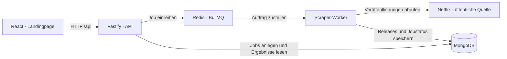

# Do we stream it?

**Heute entdecken, was als Nächstes auf Netflix erscheint.**


[](LICENSE)

Ein selbst hostbares Release-Radar für Streaming-Anbieter. Den Anfang macht
**Netflix**: Neue Filme, neue Serien und vor allem **zukünftige Veröffentlichungen**
sollen gesammelt, nach Datum und Region abgefragt und über eine API angezeigt werden.
Die API liefert strukturierte JSON-Daten für die eigene Oberfläche, andere Clients
und mögliche LLM-Anwendungen.

> **Aktueller Stand:** Frontend, Backend und API-Endpunkte sind vorhanden.
> Das Backend verarbeitet derzeit Demo-Daten mit Mocks im Arbeitsspeicher.
> Ein API-Aufruf auf diesem Branch ruft noch keine echten Netflix-Daten ab.

[Loslegen](#in-fünf-minuten-startklar) · [Architektur](#zielarchitektur) · [API](#api-ausprobieren) · [Dark Drops](#desert-strikes--dark-drops)

## Das Produkt

Der geplante Ablauf passt auf eine Seite:

1. **Datum und Region wählen.** Welche Filme und Serien erscheinen an diesem Tag?
2. **Start Scraper klicken.** Jeder bewusste Start erzeugt einen eigenen Job, ohne Login.
3. **Den Status verfolgen.** Der Worker verarbeitet den Auftrag asynchron.
4. **Ergebnisse ansehen.** Veröffentlichungen erscheinen auf derselben Seite und sind über die API abrufbar.

Bereits gespeicherte Ergebnisse sollen sich auch ohne neuen Scraper-Lauf lesen lassen.
Der Release-Kalender berücksichtigt angekündigte zukünftige Erscheinungen; welche
Zeiträume und Regionen tatsächlich verfügbar sind, hängt von der jeweiligen Quelle ab.
Weitere Streaming-Anbieter können später über zusätzliche Quellen ergänzt werden.

## Was ist schon drin?

| Bereich | Stand auf diesem Branch |
| --- | --- |
| React-Frontend mit TypeScript und Vite | Vorhanden; Startseite zeigt den Backend-Status |
| Fastify-Backend mit TypeScript | Vorhanden; Health-Endpunkt und zwei fachliche API-Endpunkte |
| Jobs starten und nach Datum/Region abfragen | Vorhanden, mit injizierbaren Mock-Abhängigkeiten |
| MongoDB-Persistenz und gemeinsame Datenverträge | Geplant in [Issue #1](https://github.com/do-we-stream-it/do-we-stream-it/issues/1) |
| Echter Netflix-Scraper und Queue-Worker | Separate Arbeit in [Issue #2](https://github.com/do-we-stream-it/do-we-stream-it/issues/2); hier noch nicht integriert |
| Start-Button, Jobstatus und Release-Ergebnisse im Frontend | Geplant in [Issue #4](https://github.com/do-we-stream-it/do-we-stream-it/issues/4) |
| Desert Strikes / Dark Drops | Spielbares Canvas-Minigame im Modal, mit sichtbarem Einstieg |

Die aktuelle Demo-Queue führt einen Fake-Scraper nach ungefähr 0,5 Sekunden im
Backend-Prozess aus. Seine Titel und Anbieter sind Testdaten; auch Einträge für
Prime Video oder Disney+ bedeuten keine echte Anbieter-Unterstützung. Jobs und
Ergebnisse gehen bei einem Backend-Neustart verloren.

## In fünf Minuten startklar

**Voraussetzungen:** Node.js 24 oder neuer und npm 11 oder neuer.
Mit installiertem nvm wählt `nvm use` die Version aus der [`.nvmrc`](.nvmrc).

Im Repository-Root:

```sh
npm ci
npm run dev
```

| Anwendung | Adresse |
| --- | --- |
| Frontend | http://localhost:5173 |
| Backend | http://127.0.0.1:3000 |
| Health-Endpunkt | http://127.0.0.1:3000/api/health |

Beide Entwicklungsprozesse laden Änderungen automatisch neu. `Ctrl+C` beendet sie.
Das aktuelle Setup funktioniert mit den eingebauten Mocks ohne MongoDB oder Redis.

### Konfiguration

Die Standardwerte reichen für die lokale Demo. Für eigene Einstellungen die
Umgebungsbeispiele in den jeweiligen Workspace kopieren:

```sh
cp apps/backend/.env.example apps/backend/.env
cp apps/frontend/.env.example apps/frontend/.env
```

| Workspace | Variable | Standardwert |
| --- | --- | --- |
| Backend | `HOST` | `127.0.0.1` |
| Backend | `PORT` | `3000` |
| Frontend | `API_PROXY_TARGET` | `http://127.0.0.1:3000` |

Vite leitet relative `/api`-Anfragen an das Backend weiter. Bei einem anderen
Backend-Port muss auch `API_PROXY_TARGET` angepasst werden. `.env`-Dateien werden
von Git ignoriert. Eine Root-`.env` wird vom aktuellen App-Setup nicht eingelesen.

## Zielarchitektur



Das Backend nimmt Aufträge entgegen und liefert gespeicherte Ergebnisse. Der
Worker übernimmt die Abrufe und Normalisierung. MongoDB speichert Jobs und
Releases, Redis verbindet API und Worker über eine dauerhafte Queue.

Für die Umsetzung gelten diese Grenzen:

- **Frontend:** spricht mit der API; Datenbank und Queue sind über das Backend erreichbar.
- **API:** validiert Eingaben, erstellt Jobs und liest Ergebnisse; der echte Scraper läuft im Worker.
- **Worker:** verarbeitet Queue-Aufträge, normalisiert Quellen und speichert erst dann einen erfolgreichen Abschluss.
- **Persistenz und Verträge:** gehören in die gemeinsamen Pakete aus Issue #1; die Anwendungen verwenden dieselben Schnittstellen.

Ein Release-Datum beschreibt die regionale Veröffentlichung. Der Zeitpunkt des
Scrapings wird separat gespeichert. Wiederholte Abrufe derselben Veröffentlichung
sollen vorhandene Daten aktualisieren. Neue Nutzerstarts erhalten jeweils eine
neue Job-ID.

Die Backend-Abhängigkeiten werden bereits über `buildApp` injiziert. Die aktuelle
Implementierung verwendet dafür [Mock-Repository und Mock-Queue](apps/backend/src/mock/).
Die dauerhafte Infrastruktur und die gemeinsamen Pakete werden separat integriert.

## API ausprobieren

Die API ist ohne Login erreichbar. Datum und Region verwenden standardmäßig den
heutigen **UTC-Kalendertag** und `DE`. Das Datum muss ein tatsächlicher Kalendertag
im Format `YYYY-MM-DD` sein.

### Einen Job starten

`POST /api/scraper/jobs` akzeptiert einen optionalen JSON-Body mit `date` und `country`.
Jeder gültige Aufruf erstellt einen neuen Job. Nach bestätigtem Enqueue antwortet
die API mit **HTTP 202** und `{ "job": ... }`.

```sh
curl --request POST http://127.0.0.1:3000/api/scraper/jobs \
  --header 'content-type: application/json' \
  --data '{"date":"2026-10-20","country":"DE"}'
```

Die Antwort enthält die Job-ID für spätere Statusabfragen. In der aktuellen Demo
werden auch zukünftige Datumsangaben mit Fake-Ergebnissen beantwortet.

### Ergebnisse lesen

`GET /api/releases` liefert `{ date, country, job, releases }`.

```sh
curl 'http://127.0.0.1:3000/api/releases?date=2026-10-20&country=DE'
```

Mit dem optionalen Parameter `jobId` wird zusätzlich der gespeicherte Jobstatus
geliefert. Ohne `jobId` ist `job` gleich `null`.

```sh
# Die UUID aus der Startantwort einsetzen:
curl 'http://127.0.0.1:3000/api/releases?date=2026-10-20&country=DE&jobId=UUID_AUS_DER_STARTANTWORT'
```

Bis `succeeded` oder `failed` erneut abfragen. Datum und Region müssen zu dem Job
passen. Die Ergebnisabfrage startet keinen Scraper; ohne gespeicherte Releases
liefert sie ein leeres Array.

### Fehler verstehen

| HTTP-Status | Beispiel | Bedeutung |
| --- | --- | --- |
| `400` | `VALIDATION_ERROR` / `JOB_MISMATCH` | Ungültige Eingabe oder ein Job für ein anderes Datum/eine andere Region |
| `404` | `JOB_NOT_FOUND` | Unbekannte Job-ID |
| `503` | `ENQUEUE_FAILED` | Der Auftrag konnte nicht eingereiht werden; die Antwort enthält seine Job-ID |
| `500` | `INTERNAL_ERROR` | Interner Fehler; Details stehen im Backend-Log |

Fehlerantworten verwenden dieses Format; `jobId` ist optional:

```json
{
  "error": {
    "code": "JOB_NOT_FOUND",
    "message": "Job not found."
  }
}
```

## Desert Strikes / Dark Drops

**Ein kurzer Trip in die Wüste, direkt auf der Startseite.**

Mit **„Dark Drops spielen“** öffnest du das Minigame im Modal. Steuere deinen
Wüstenflitzer durch fallende Drops und überlebe **30 Sekunden mit drei Leben**.
Jeder ausgewichene Drop bringt 10 Punkte; für eine überlebte Runde gibt es
100 Bonuspunkte plus 25 pro verbliebenem Leben. Nach einem Treffer bist du
eine Sekunde geschützt. Deinen Rekord speichert der Browser lokal, sofern
Local Storage verfügbar ist.

| Aktion | Steuerung |
| --- | --- |
| Links / rechts bewegen | `←` / `→`, `A` / `D` oder die Touch-Buttons gedrückt halten |
| Starten / pausieren / fortsetzen | Leertaste oder der sichtbare Aktionsbutton |
| Pause / fortsetzen | `P`; beim Wechseln des Tabs pausiert das Spiel automatisch |
| Neue Runde | `R` oder „Neustart“ |
| Vollbild | `F` oder „Vollbild“, sofern der Browser es unterstützt |
| Schließen | `Escape` oder „Schließen“; im Vollbild beendet Escape zuerst das Vollbild |

Das Modal hält den Tastaturfokus im Spiel und gibt ihn beim Schließen an den
Auslöser zurück. Das Spiel läuft vollständig im Frontend und verwendet keine
Scraper-API: Öffnen und Schließen verändert keine laufenden Jobs.

## Projektstruktur

```text
apps/
  backend/
    src/
      app.ts          # Fastify-Anwendung und injizierbare Abhängigkeiten
      server.ts       # Serverstart und Shutdown
      routes.ts       # Jobs starten und Releases lesen
      contracts.ts    # Vorläufige API- und Repository-Schnittstellen
      validation.ts   # Datum, Region und Job-ID prüfen
      routes.test.ts  # API-Verhalten mit Mocks prüfen
      mock/           # Demo-Repository, Queue und Scraper
  frontend/
    src/
      App.tsx         # Startseite mit Backend-Status und sichtbarem Spieleinstieg
      main.tsx        # React-Einstiegspunkt
      styles.css      # Gestaltung
      game/           # Modal, Canvas-Darstellung und unabhängige Spielsimulation
    tests/
      game.test.ts    # Spielzustände, Bewegung, Kollisionen und Punkte
    vite.config.ts    # Vite und API-Proxy
package.json          # npm Workspaces und gemeinsame Befehle
tsconfig.base.json    # Gemeinsame TypeScript-Einstellungen
```

## Entwicklung und Qualität

| Befehl | Zweck |
| --- | --- |
| `npm run dev` | Backend und Frontend parallel starten |
| `npm run dev:backend` | Backend separat starten |
| `npm run dev:frontend` | Frontend separat starten |
| `npm run typecheck` | TypeScript in beiden Workspaces prüfen |
| `npm test --workspace @do-we-stream-it/backend` | Backend-API-Tests ausführen |
| `npm test --workspace @do-we-stream-it/frontend` | Minigame-Simulation prüfen |
| `npm run build` | Beide Anwendungen bauen |
| `npm start` | Das bereits gebaute Backend starten |
| `npm run preview --workspace @do-we-stream-it/frontend` | Frontend-Build lokal auf Port 4173 ansehen |

Die Backend- und Spieltests verwenden den Node-Test-Runner mit TypeScript über `tsx`.
Für dieses TypeScript-Projekt sind die dokumentierten Architekturgrenzen,
Typprüfung und Tests an den Schnittstellen die Grundlage. Automatisierte Prüfungen
für die Importgrenzen sind derzeit noch nicht eingerichtet.

Die Tests der echten Queue, ihrer Wiederholungen und des Scraper-Parsers gehören
zum Worker-Ticket. Die Integration mit MongoDB und die Tests der Persistenz gehören
zum Datenbank-Ticket.

## Build und Hosting

```sh
npm ci
npm run build
npm start
```

Der Backend-Build liegt in `apps/backend/dist`, die statische Website in
`apps/frontend/dist`. Für ein gemeinsames Hosting muss der Webserver `/api` an
das Backend weiterleiten. Der Vite-Proxy gilt für Entwicklung und lokale Vorschau;
`vite preview` dient zur lokalen Ansicht des Frontend-Builds.

Der aktuelle Backend-Start verwendet auch nach dem Build die Demo-Mocks. Echte
Daten und dauerhafte Jobs setzen die Integration von MongoDB und Worker voraus.

## Weiterbauen

- [#1 · MongoDB, Persistenz und gemeinsame Datenverträge](https://github.com/do-we-stream-it/do-we-stream-it/issues/1)
- [#2 · Netflix-Scraper und Queue-Worker](https://github.com/do-we-stream-it/do-we-stream-it/issues/2)
- [#3 · Backend-API und ihre Schnittstellen](https://github.com/do-we-stream-it/do-we-stream-it/issues/3)
- [#4 · Landingpage mit Start, Status und Ergebnissen](https://github.com/do-we-stream-it/do-we-stream-it/issues/4)

## Dokumentation und Lizenz

[Fastify](https://fastify.dev/docs/latest/) · [React](https://react.dev/) ·
[Vite](https://vite.dev/guide/) · [npm Workspaces](https://docs.npmjs.com/cli/v11/using-npm/workspaces/)

Der npm-Override für `shell-quote` verwendet eine korrigierte Version für die
Abhängigkeit des Entwicklungs-Runners. Die aufgelösten Versionen stehen im Lockfile.

Dieses Projekt steht unter der [MIT-Lizenz](LICENSE).
